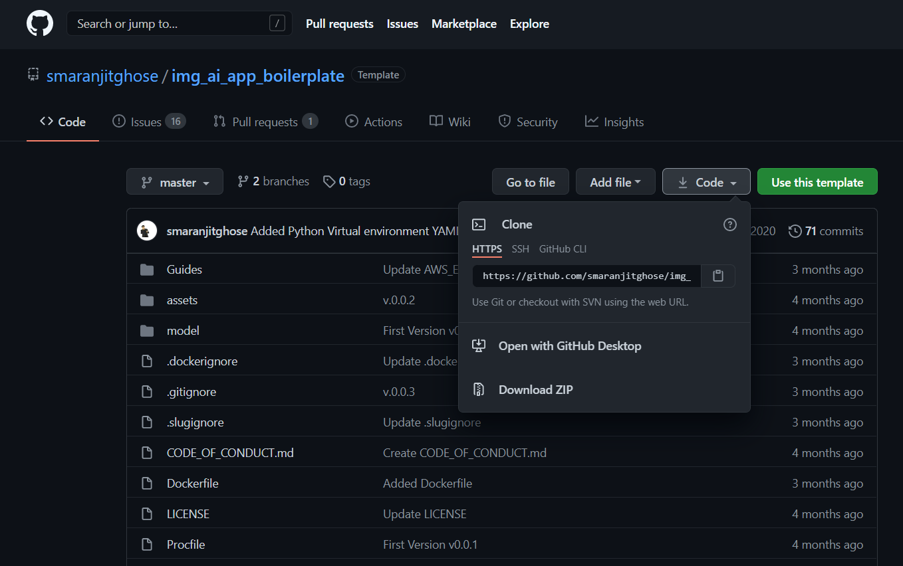
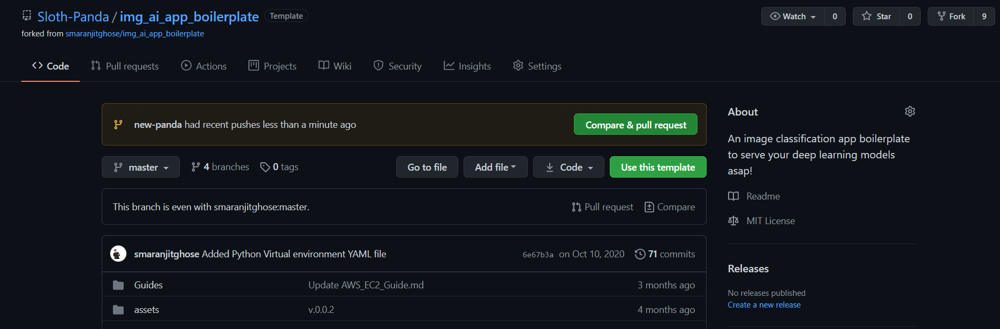
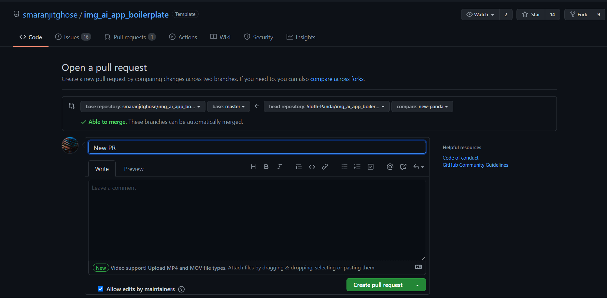

<h1 align="center"><b>Guidelines for Contribution</b></h1>

<p align="center"></p>

We want to make contributing to this project as easy and as transparent as possible, whether it's:<br>

- Reporting a bug :bug:

- Submitting a fix :mag_right:

- Proposing new features :bulb:

If you wish to contribute to this project, please raise an issue and wait for the project maintainers to approve it or give feedback

<h2 align="center"><b>How to make a Pull Request? 👇</b></h2>

<p align="center"></p>

**1.** Fork [this](https://github.com/smaranjitghose/img_ai_app_boilerplate) repository.

**2.** Clone your forked copy of the project.

```
git clone --depth 1 https://github.com/<your_user_name>/img_ai_app_boilerplate.git
```



**3.** Navigate to the project directory :file_folder: .

```
cd img_ai_app_boilerplate
```

**4.** Add a reference to the original repository.

```
git remote add upstream https://github.com/smaranjitghose/img_ai_app_boilerplate.git
```

**5.** Check the remotes for this repository.

```
git remote -v
```

**6.** Always take a pull from the upstream repository to your master branch to keep it at par with the main project(updated repository).

```
git pull upstream master
```

**7.** Create a new branch.

```
git checkout -b <your_branch_name>
```

**8.** Perform your desired changes to the code base.

<p align="center"></p>

**9.** Track your changes:heavy_check_mark: .

```
git add .
```

**10.** Commit your changes .

```
git commit -m "Relevant message"
```

**11.** Push the committed changes in your feature branch to your remote repo.

```
git push -u origin <your_branch_name>
```

**12.** To create a pull request, click on `compare and pull requests`. Please ensure you compare your feature branch to the desired branch of the repo you are suppose to make a PR to.



**13.** Then add an appropriate title and description to your pull request that explains your changes and efforts done.

**14.** Click on `Create Pull Request`.



**15** Voila :exclamation: You have made a PR to the img_ai_app_boilerplate project :boom: . Sit back patiently and relax while the project maintainers review your PR. Please understand at times the time can vary from a few hours to a few days

<p align="center"></p>
