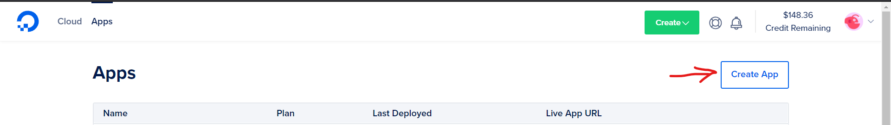
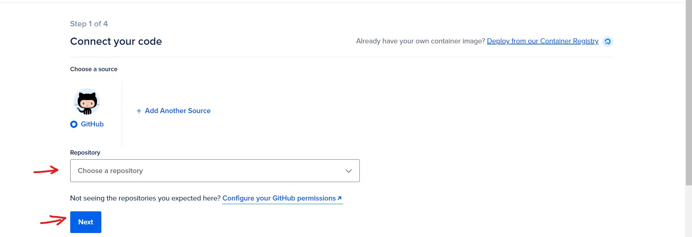
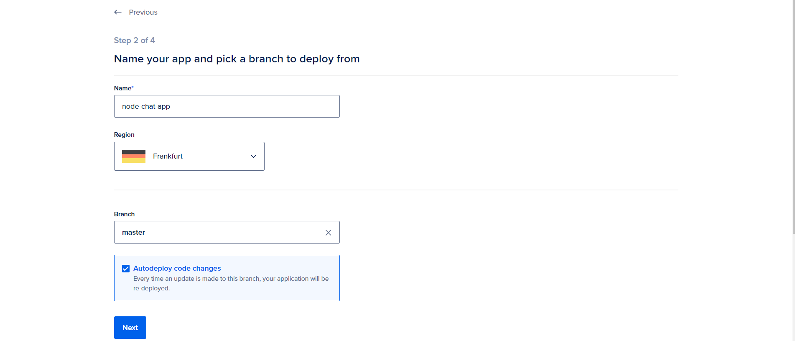
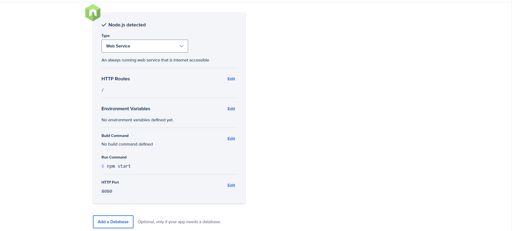
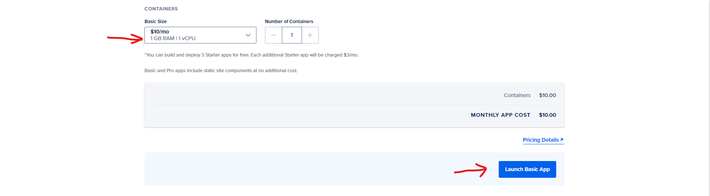

### Deploying the App to Digital Ocean

1. Go to https://cloud.digitalocean.com/apps. 

2. click Create App.

    
  </a>

3. Select the source for your app. You can choose a GitHub repository, a GitLab repository, or a container image you uploaded to DigitalOcean Container Registry.

4. Select the repository that contains your source code, and click Next.

    
  </a>

5. Enter a name for your app, choose the region where you'd like your app to be hosted, and specify the branch or tag in your repository that contains your app's source code. If you'd like to automatically re-deploy your app when pushing to this branch/tag, select Autodeploy code changes. Click Next.

    
  </a>

Note : App Platform will inspect the code and select an appropriate runtime environment (such as Node, Ruby, etc). If you need to override this, you can see if there is a better option in the drop-down labeled Type as well. If nothing suitable appears there, 

6. App Platform will display build and run commands that it detected, which you can now customize as needed.

Note : If the use of environment variables is required, click Edit and supply them. Click the Encrypt checkbox to ensure a variable's value is obscured in all build, deploy, and application logs.

7. If your app needs a database, you can add a dev database or an existing managed database from your DigitalOcean account. The connection details for your database will be accessible via environment variables so that they can be conveniently accessed in your code.

    
  </a>

8. Select a plan, and click Launch App.

    
  </a>

Useful tips:
- Refer https://www.digitalocean.com/community/tutorials to learn more about hosting.
- DigitalOcean also provides free credit using which you can host our website DigitalOcean.

