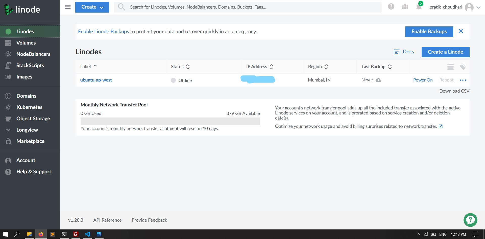
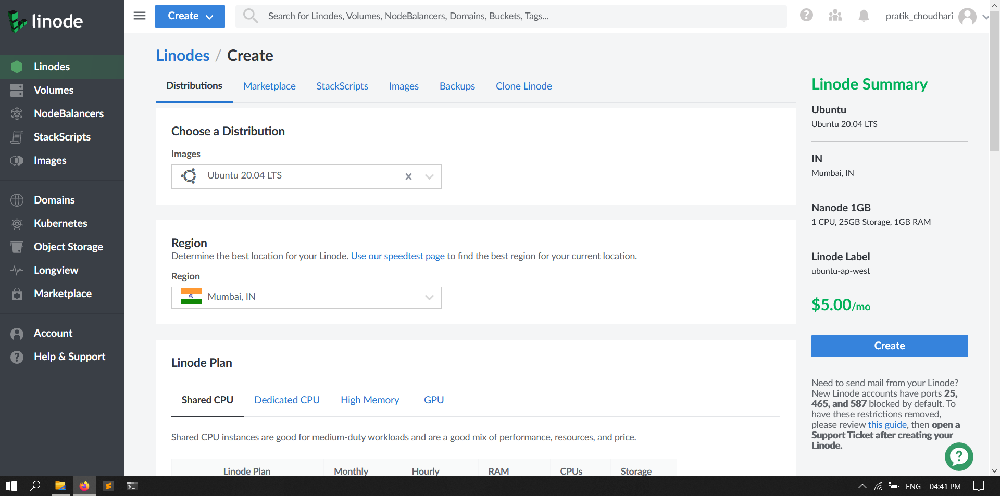
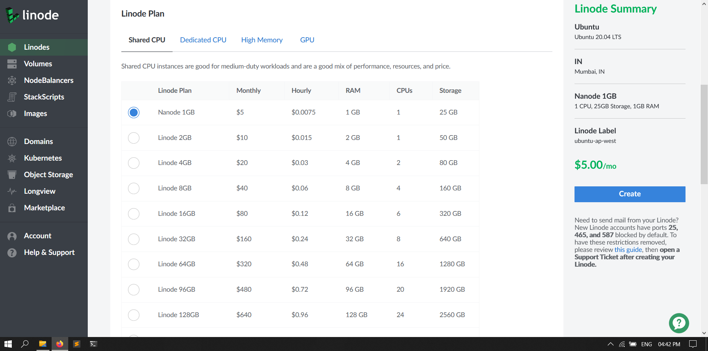
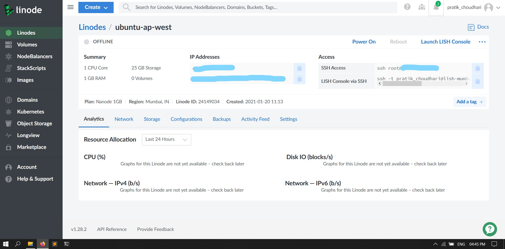
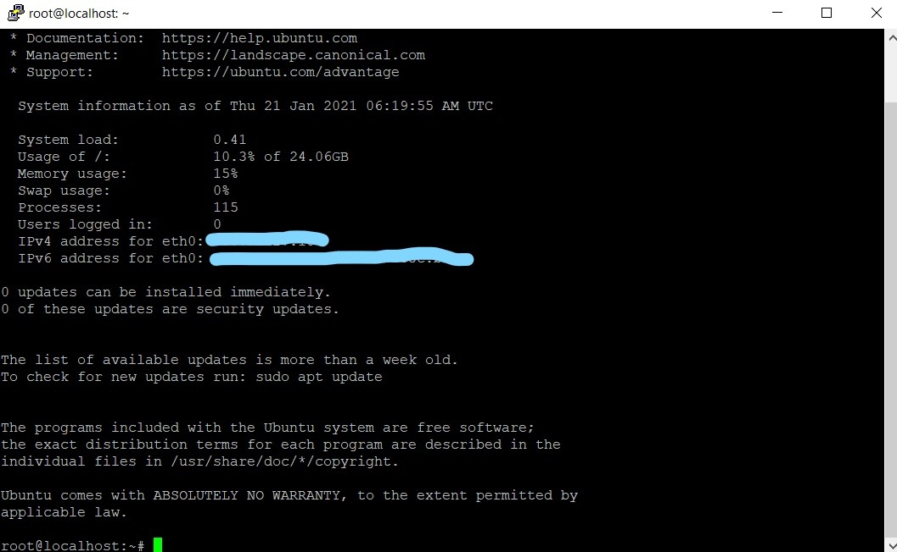
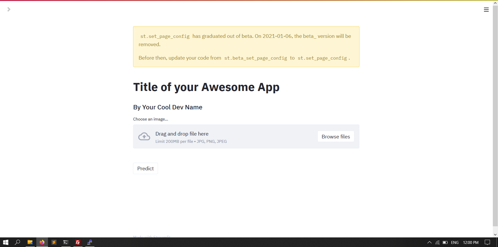

# img_ai_app_boilerplate deployement on [Linode](www.linode.com)

This is a step-by-step guide on how to deploy a streamlit app on linode☁

Let's dive straight in...

1. Create an account on [linode.com](www.linode.com), following information is required to signup:
    - Name
    - Email
    - Address
    - Credit card or visa/mastercard debit card details
2. After creating and verifying your account it's time to create an ubuntu(you can choose between different flavors of linux) virtual machine. You will be presented by a linode dashboard after successful login, next click on `Linodes` from the left side menu and click on `Create`. 

3. Here we are meant to specify our VM configuration such as OS, hardware specs, location and root password. So go ahead and choose your server location, linux distro and the plan of your liking. Carefully enter your root password and make sure it remains confidential, with this password and VM public IP anyone can gain access to your VM. I have created a nano linode for demonstration purposes. Click on `Create` to launch your VM. After provisioning the resources, linode will, by default, boot up your VM.

4. Make sure your linode is online(offline in screenshot) and then SSH into the machine using `user@host_ip_address` given for the linode. Windows users can use PuTTy and linux users use OpenSSH.

5. A successful SSH session will look like this

6. This VM is staright out of the box so now we need to update it according to our applications, one-by-one execute the following commands in codeblocks inorder on your SSH terminal.
    1. `sudo apt update`-> updates APT
    2. `sudo apt install apache2`-> to serve application on web
    3. `apache2 -version`-> check if installed
    4. `sudo ufw app list`-> check firewall
    5. `sudo ufw allow ‘Apache’`->allow apache through firewall
    6. `sudo systemctl status apache 2 `-> make sure apache server is running, press Q to exit
    7. `sudo apt install libapache2-mod-wsgi python-dev`-> install supporting packages
    8. `sudo apt install python-pip`-> install PIP package manager
    9. `sudo apt install git-all`-> install git

7. On completing all above steps we are now ready to import our code, install the requirements and fire up the streamlit application. Now, to import our code we have two choices:
    - Transfer code files via FTP/SCP
    - use git clone

8. In this guide I am going to simply `git clone` the main boilerplate project and run it. Next steps:
    1. `mkdir my_app`-> create seperate directory
    2. `cd my_app`
    3. `git clone your_repo_link`
    4. `cd your_repo_link`
    5. `pip3 install -r requirements.txt`-> install python requirements

9. It's now time to run our app and view it in browser:
    - `streamlit run app.py`

10. Now go to your browser and enter the VM public IP address which you can see on your Linode dashboard and hit `Enter`. Voila!

