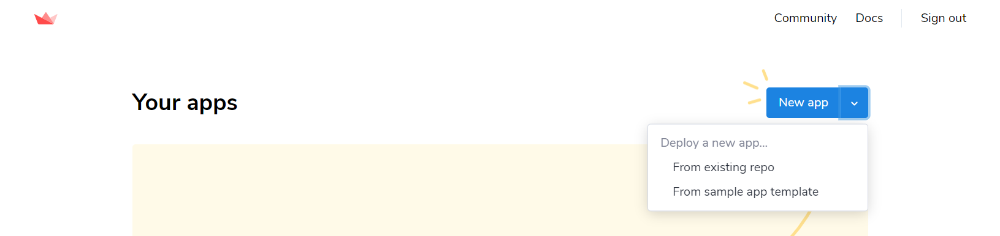
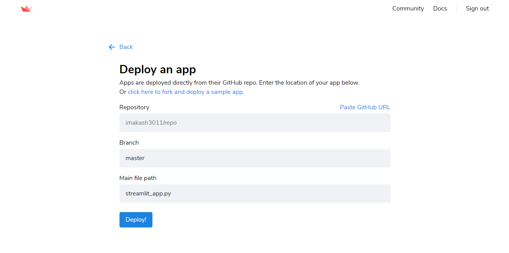

## Deploying the App Using Streamlit

### 1. Get a Streamlit sharing account
- To get started, first request an invite at streamlit.io/sharing. Streamlit sharing is currently available by invitation only.

### 2. Put your Streamlit app on GitHub
- Make sure your app is in a public GitHub repo and that you have a requirements.txt file.

Note : If you need to generate a requirements file, try using pipreqs.

### 3. Log in to share.streamlit.io
- The first thing you’ll see is a button to login with GitHub. Click on the button to login with the primary email associated with your GitHub account.

Note : If the email you originally signed-up with isn’t the primary email associated with your GitHub account, just reply to your invite email telling us your primary Github email so we can grant access to the correct account.

### 4. Select your App from GitHub.
- Select your App from existing GitHub repo or from sample app template or just simply click New App.

    
  </a>

### Deploy your app
- After clicking on New App fill in your repo, branch, and file path, and click “Deploy”. Your app will take a minute or two to deploy and then you’ll be ready to share!

    
  </a>

### Share, update, and collaborate
- Now that your app is deployed you can easily share it and collaborate on it.

#### Useful tips : 
- Streamlit is mainly used for Data Science based Web-App.
- Streamlit is extremely easy to use, it is highly recommended for those person who is learning Data Science or Machine Learning to built their projects.
- Do refer their documentation to read more about Streamlit.